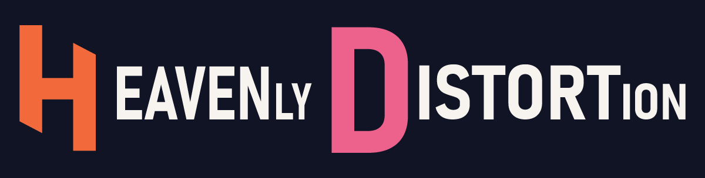
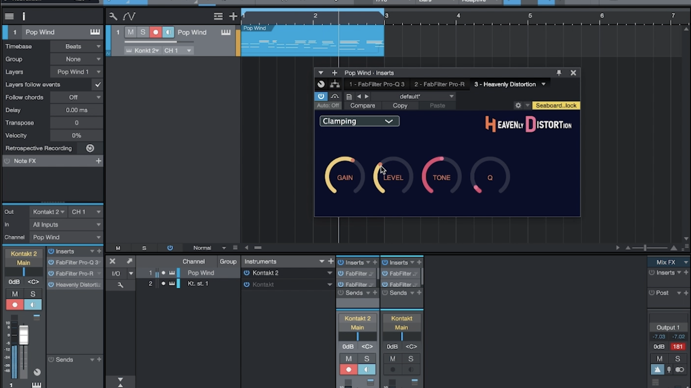

# Heavenly Distortion
Screenshots:

---
> <h2 id='0'>Table of Content</h2>

1. <a href='#demovideo'>Demo Video</a>
2. <a href='#compileguide'>Compile Guide</a>
3. <a href='#otherresources'>Other Resources</a>

<h1 id="demovideo" style="font-weight: 600; text-transform: capitalize; font-family: 'Segoe UI', Tahoma, Geneva, Verdana, sans-serif; color: #EA638C;">Demo Video</h1>
<a href='#0' style='background: #000; margin:0 auto; padding: 5px; border-radius: 5px;'>Back to ToC</a>  

<h1 id="compileguide" style="font-weight: 600; text-transform: capitalize; font-family: 'Segoe UI', Tahoma, Geneva, Verdana, sans-serif; color: #EA638C;">Compile Guide</h1>
<a href='#0' style='background: #000; margin:0 auto; padding: 5px; border-radius: 5px;'>Back to ToC</a>  

This distortion plug-in uses <a href='https://github.com/jacky776690g60/Audio-Libs'>my another audio library</a> for JUCE. Clone it first before proceeding.

### **Linking without compiling**
   
   - In Projucer, make sure File Explorer includes any files that need to be compiled.

   - Add the necessary header path in Projucer using the project settings (gear icon on the top left).

### **Placeholder**

<h1 id="otherresources" style="font-weight: 600; text-transform: capitalize; font-family: 'Segoe UI', Tahoma, Geneva, Verdana, sans-serif; color: #EA638C;">Other Resources</h1>
<a href='#0' style='background: #000; margin:0 auto; padding: 5px; border-radius: 5px;'>Back to ToC</a>  

- [Clipping](https://github.com/jacky776690g60/Audio-Libs/tree/main/DSP/ClippingAlgorithms)
- [Distortion](https://github.com/jacky776690g60/Audio-Libs/tree/main/DSP/DistortionAlgorithms)
- [Others](https://github.com/jacky776690g60/Audio-Libs)